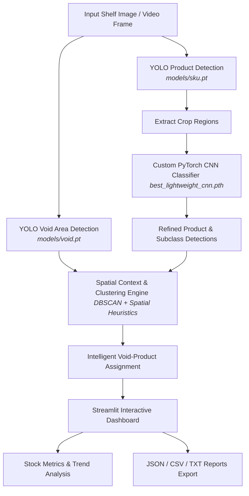

# 🛒 Intelligent Retail On-Shelf Availability (OSA) System

[](https://www.python.org/)
[](https://pytorch.org/)
[](https://github.com/ultralytics/ultralytics)
[](https://streamlit.io/)
[](https://opencv.org/)
[](https://cv-project-osa.readthedocs.io/en/latest/)

---

## 📖 Overview / Présentation du Projet

### English
In the modern retail and supermarket sectors, **out-of-stock (OOS)** situations present a critical challenge, causing up to **4% in lost annual sales** and diminishing customer loyalty. 

The **On-Shelf Availability (OSA)** Detection System is a state-of-the-art computer vision solution engineered to automatically identify empty shelf spaces (voids), locate and map individual shelves, recognize commercial products, and classify SKU subclasses. By leveraging deep learning, this system offers store managers real-time inventory visibility and actionable restocking insights to maximize sales and optimize resource planning.

### Français
Dans la grande distribution, les **ruptures de stock** représentent un enjeu majeur pouvant entraîner jusqu'à **4% de pertes de ventes annuelles**. 

Le système de détection **On-Shelf Availability (OSA)** est une solution avancée de vision par ordinateur conçue pour identifier automatiquement les espaces vides (vides de rayon), localiser précisément les étagères, et reconnaître les produits présents dans un environnement commercial. En combinant la détection d'objets rapide et des classificateurs de sous-classes précis, cette solution permet aux détaillants de réagir en temps réel pour optimiser le réapprovisionnement et maximiser leurs ventes.

---

## ✨ Core Features / Fonctionnalités Clés

*   🎯 **High-Precision Product Detection (`sku.pt`)**: YOLO-driven identification of individual products and bounding boxes.
*   🔍 **Subclass & SKU Classification (`LightweightCNN`)**: A custom, lightweight PyTorch convolutional network optimized for fine-grained classification (e.g., Coke vs. Water vs. Oil) even on compact datasets.
*   📭 **Intelligent Void Detection (`void.pt`)**: Automated mapping of empty spaces directly on the shelf lines.
*   🧠 **Spatial Proximity & Clustering Engine**: Uses **DBSCAN Clustering** and horizontal/vertical alignment metrics to dynamically infer what product *should* occupy a detected void.
*   📈 **Real-Time Interactive Dashboard**: Built with **Streamlit** and **Plotly**, displaying real-time gauges, trend charts over video streams, stock alerts, and camera configs.
*   📤 **Data Exports & Reporting**: Download immediate CSV tables, JSON structures, or formatted TXT reports for warehouse automation.

---

## 🏗️ System Architecture / Architecture du Système

The system runs a **multi-stage sequential inference pipeline** to deliver robust product mapping and void assignment:



### The 4 Pillars of the Analysis Pipeline:
1.  **Detection (`YOLOv8`)**: Locates generic items on shelves and defines spatial coordinates.
2.  **Fine-Grained Classification (`PyTorch`)**: Feeds bounding box crops to `LightweightCNN` to classify specific items (e.g., brand, flavor, type).
3.  **Spatial Context Extraction**: Groups adjacent products into logical shelf rows using DBSCAN clustering.
4.  **Intelligent Assignment**: Assigns the identity of voids by analyzing surrounding left/right and top/bottom neighbors, ensuring maximum accuracy in multi-product environments.

---

## 🛠️ Technology Stack & Dependencies

The OSA system is built using modern Python frameworks for machine learning and dashboarding:

| Technology | Category | Purpose |
| :--- | :--- | :--- |
| **Python 3.10+** | Core Language | Main pipeline and scripts execution |
| **PyTorch & Torchvision** | Deep Learning | CNN classifier training, weights loading, and inference |
| **Ultralytics YOLO** | Object Detection | Bounding box regression for products and shelf voids |
| **Streamlit** | Web Application | Fully interactive user dashboard and control panel |
| **Plotly & Matplotlib** | Data Visualization | Dynamic gauges, trend line graphs, and annotated images |
| **Scikit-Learn & SciPy** | Machine Learning | DBSCAN clustering and spatial coordinate distance matrix (`cdist`) |
| **OpenCV & Pillow** | Computer Vision | Video streaming frame capture, image resizing, and preprocessing |
| **Pandas & NumPy** | Data Processing | Tabular logs, stock level math, and high-performance array operations |

---

## 🚀 Installation & Running Guide

### 1. Prerequisites
Ensure you have **Python 3.10** or **3.11** installed. Create a clean virtual environment:

```bash
# Clone the repository
git clone https://github.com/your-username/On-Shelf-Availability-OSA.git
cd On-Shelf-Availability-OSA

# Create a virtual environment
python -m venv venv
source venv/bin/activate  # On Windows, use `venv\Scripts\activate`
```

### 2. Install Required Dependencies
Install all required libraries using `pip`:

```bash
pip install torch torchvision --index-url https://download.pytorch.org/whl/cpu  # Or GPU version if applicable
pip install streamlit opencv-python numpy pandas matplotlib plotly pillow ultralytics scikit-learn scipy
```

### 3. Run the Streamlit Dashboard
Launch the interactive retail analysis dashboard in your local browser:

```bash
streamlit run Project/app.py
```

*The interface will launch automatically at `http://localhost:8501`.*

---

## 📊 Streamlit App Usage

1.  **Configure Models (Sidebar)**: Set paths for product YOLO detection, void detection, and the custom PyTorch subclass classifier.
2.  **Upload Media**: Drag-and-drop a shelf photo (`JPG/PNG`) or a video (`MP4/MOV`).
3.  **Analyze**: Click **"Analyze Image"** or **"Analyze Video"**.
4.  **Visualize**: Interact with bounding box annotations, check missing product gauges, examine trend curves over time, and download structured reports (`JSON`, `CSV`, `TXT`).

---

## 📖 Documentation
Read our comprehensive Sphinx documentation hosted online at:
👉 **[Read the Docs - Retail Shelf Analysis (OSA)](https://cv-project-osa.readthedocs.io/en/latest/)**

---

## 📧 Support & Contact

*   **Lead Developer**: Abderrahmane Essafi
*   **Email**: [abderrahmanessafi133@gmail.com](mailto:abderrahmanessafi133@gmail.com)
*   **Project Link**: [https://github.com/abder111/On-Shelf-Availability-OSA](https://github.com/abder111/On-Shelf-Availability-OSA)
